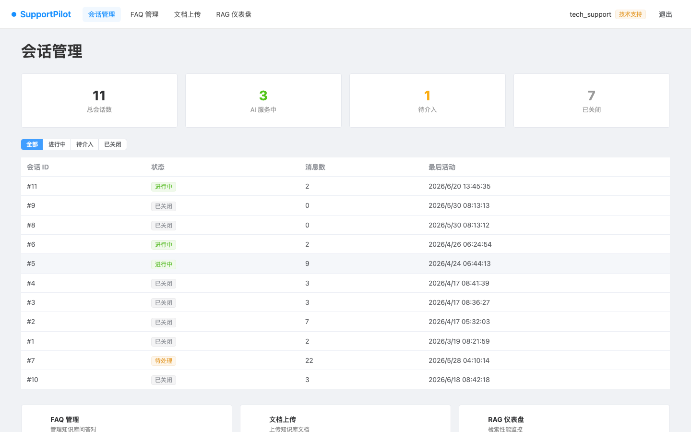
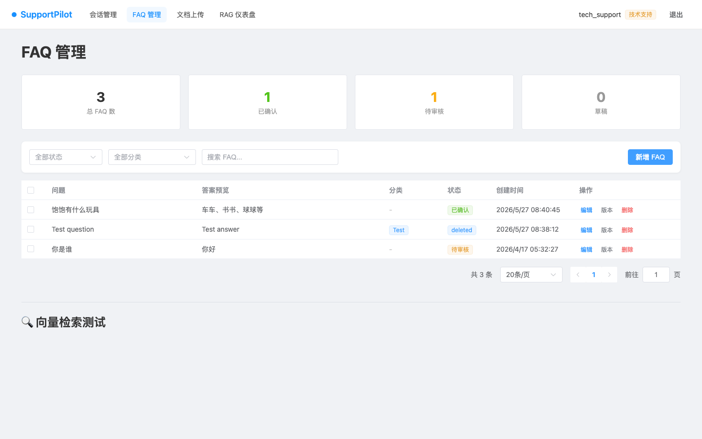
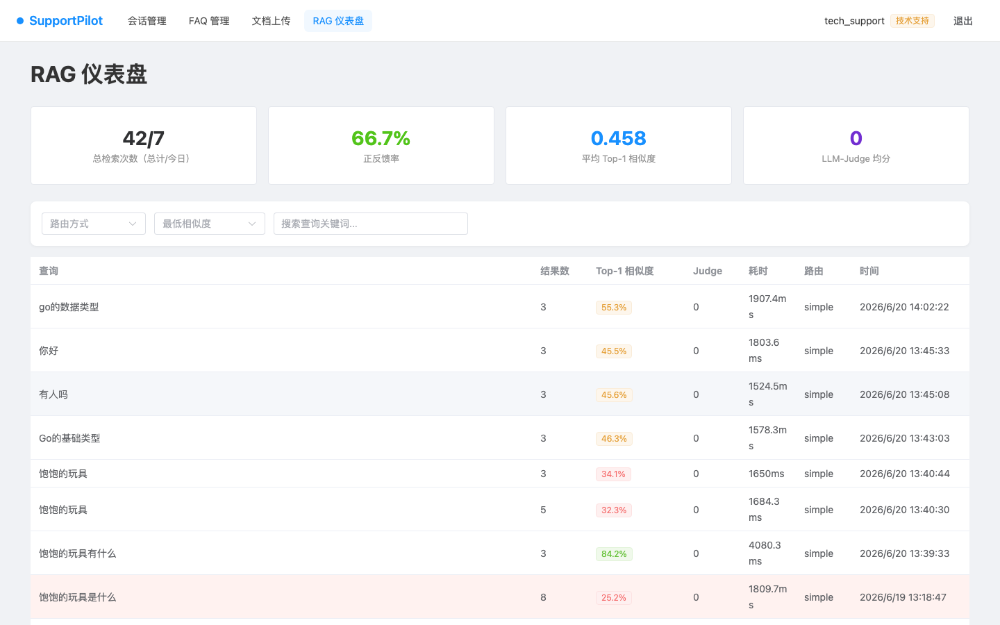

# SupportPilot

<div align="center">


**基于 Flask + Vue 3 + RAG 的智能客服系统 · 前后端分离架构**

[界面预览](#-界面预览) · [快速开始](#-快速开始) · [项目结构](#-项目结构)

</div>

---

## 📸 界面预览

| 登录 | 注册 | 技术支持仪表盘 |
|:---:|:---:|:---:|
|  |  |  |

| 会话对话 | 文档上传 | FAQ 管理 |
|:---:|:---:|:---:|
|  |  |  |

| RAG 仪表盘 |
|:---:|
|  |

---

## ✨ 核心特性

### 前后端分离
- 🎨 **Vue 3 SPA 前端** — Composition API + Element Plus 组件库
- ⚡ **Vite 开发体验** — HMR 热更新、按需编译、Proxy 代理 API
- 🔐 **JWT 认证** — Access + Refresh Token 双 Token 机制
- 📦 **纯 API 后端** — Flask RESTful JSON，统一 `/api/v1/` 前缀

### 智能客服
- 🤖 **RAG 检索增强生成** — 基于向量检索 + LLM 的精准回答
- 📚 **Agentic RAG (自我纠正)** — 9 节点 LangGraph 状态机，LLM 驱动工具选择与查询分解，相关性门控 + 忠实度验证，支持自动回环纠正
- 🔍 **Small-to-Big 检索** — 小块索引，大块返回，兼顾精度与上下文
- 🔁 **混合检索** — BM25 + 向量 + RRF 融合，BM25 自动从 ChromaDB 构建索引

### 工单与 FAQ
- 🎫 **工单系统** — 人工介入触发，状态跟踪 (open/pending/closed)
- 📝 **FAQ 审核工作流** — AI 生成草稿 → 技术支持审核 → 向量化同步
- 📊 **RAGAS 自动化评估** — 4 指标质量评测 (Faithfulness / Relevancy / Precision / Recall)，[详见评估流程文档](./docs/ragas-evaluation.md)

---

## 🏗️ 技术架构

### 系统架构

```
┌─────────────────────────────────────────────────────────────────────────┐
│                        Vue 3 SPA Frontend                               │
│  ┌──────────┐ ┌───────────┐ ┌───────────┐ ┌───────────┐ ┌───────────┐  │
│  │  Login/  │ │   Chat    │ │    FAQ    │ │  Document │ │    RAG    │  │
│  │ Register │ │  Layout   │ │  Manage   │ │  Upload   │ │ Dashboard │  │
│  └────┬─────┘ └─────┬─────┘ └─────┬─────┘ └─────┬─────┘ └─────┬─────┘  │
│       │             │             │             │             │         │
│       └─────────────┴──────┬──────┴─────────────┴─────────────┘         │
│                            │ JWT Bearer Token                            │
└────────────────────────────┼────────────────────────────────────────────┘
                             │
┌────────────────────────────┼────────────────────────────────────────────┐
│                    Flask API Server (Pure JSON)                          │
│  ┌───────────┐ ┌───────────┐ ┌───────────┐ ┌───────────┐               │
│  │ /api/v1/  │ │ /api/v1/  │ │ /api/v1/  │ │ /api/v1/  │               │
│  │   auth    │ │   chat    │ │    faq    │ │ documents │               │
│  └───────────┘ └───────────┘ └───────────┘ └───────────┘               │
│                                                                         │
│                          ┌──────────────────────────────────────────────┤
│                          │        Agentic RAG (9-Node State Machine)    │
│                          │                                              │
│   User Query             │  ┌──────────────┐    ┌──────────────┐       │
│      │                   │  │   query      │    │    tool      │       │
│      ▼                   │  │  understand  │    │  selection   │       │
│  ┌──────────┐            │  └──────┬───────┘    └──────┬───────┘       │
│  │  Query   │            │         │                    │               │
│  │  Router  │            │         ▼                    ▼               │
│  └────┬─────┘            │  ┌──────────────┐    ┌──────────────┐       │
│       │                  │  │   query      │    │    tool      │       │
│  ┌────┴────┐             │  │ decompose    │    │  execution   │       │
│  │         │             │  └──────┬───────┘    └──────┬───────┘       │
│  ▼         ▼             │         │                    │               │
│ ┌─────┐ ┌─────────┐      │         │                    ▼               │
│ │Simple│ │Agentic  │      │  ┌──────┴──────────────────────┐            │
│ │Vector│ │ Path ───┼──────┼──►│       tool_selection        │            │
│ └─────┘ └─────────┘      │  └─────────────┬───────────────┘            │
│                          │       ... → relevance_check → ...           │
│                          │       ... → result_aggregation → ...        │
│                          │       ... → faithfulness_check → END        │
│                          └──────────────────────────────────────────────┘
│
│   Retrieval Tools: vector_search | bm25_search | metadata_filter | ensemble_retrieval
│   Small-to-Big: 400 char child chunks → 2000 char parent chunks
│
├──────────────────────────────────────────────────────────────────────────┤
│                         Data Layer                                       │
│  ┌──────────────┐ ┌──────────────┐ ┌──────────────┐                     │
│  │   SQLite /   │ │   ChromaDB   │ │   LLM Client │                     │
│  │  PostgreSQL  │ │ (Vector DB)  │ │ (Multi-prov) │                     │
│  └──────────────┘ └──────────────┘ └──────────────┘                     │
└──────────────────────────────────────────────────────────────────────────┘
```

### 技术栈

| 层级 | 技术 |
|------|------|
| 前端 | Vue 3 + Vite + Element Plus + Pinia + Vue Router |
| 后端 | Flask 3.0 (纯 API，无 SSR) |
| 认证 | JWT (Access + Refresh Token) + flask-cors |
| 数据库 | SQLite (开发) / PostgreSQL (生产) |
| RAG | LangChain + ChromaDB + LangGraph |
| Embedding | BAAI/bge-m3 (1024 维，中英多语言) |
| 检索策略 | Small-to-Big + Hybrid (Vector + BM25) + RRF 融合 |
| Agent | LangGraph 9-节点状态机 + 自我纠正回路 |
| 质量保障 | 相关性门控 + 忠实度验证 + 查询改写回环 |
| LLM | 可配置 (DeepSeek / Qwen / OpenAI 兼容 / Anthropic 兼容) |

---

## 🚀 快速开始

### 1. 安装后端依赖

```bash
pip install -r requirements.txt
```

### 2. 配置环境变量

```bash
cp .env.example .env
# 编辑 .env 设置 LLM_API_KEY 等
```

### 3. 安装前端依赖

```bash
cd frontend
npm install
cd ..
```

### 4. 启动应用

```bash
# 仅后端
bash start.sh
# 访问 http://localhost:5050

# 后端 + 前端开发服务器
bash start.sh -f
# 前端：http://localhost:5173
# 后端：http://localhost:5050
```

### 5. 测试账号

启动后自动创建默认技术支持账号：
- 用户名：`tech_support`
- 密码：`tech123`

---

## 📁 项目结构

```
SupportPilot/
├── app/                    # Flask API 应用（纯 API，无 SSR）
│   ├── api/                # API 蓝图
│   │   ├── auth.py         # JWT 认证（login/register/refresh）
│   │   ├── chat.py         # 聊天记忆 API
│   │   ├── faq.py          # FAQ 管理 API
│   │   ├── tickets.py      # 工单 API
│   │   ├── rag_dashboard.py # RAG 检索日志 API
│   │   ├── routes.py       # 文档处理 API
│   │   └── v1/             # v1 RESTful API（JWT 认证）
│   │       ├── chat.py     # 会话/消息 API
│   │       ├── faq.py      # FAQ CRUD API
│   │       └── documents.py # 文档上传管线 API
│   ├── services/           # 业务逻辑层
│   ├── models/             # 数据模型（User/Conversation/Message/FAQ/Document 等）
│   └── utils/              # 工具函数（JWT/Auth/Sanitize/Response）
├── frontend/               # Vue 3 SPA 前端
│   ├── src/
│   │   ├── api/            # Axios 封装 + API 调用
│   │   ├── router/         # Vue Router（History 模式 + 导航守卫）
│   │   ├── stores/         # Pinia 状态管理（auth/chat）
│   │   ├── views/          # 页面组件（Login/Register/Chat/FaqManage/DocumentUpload/TechDashboard/RagDashboard）
│   │   ├── components/     # 公共组件（layout/chat/common）
│   │   └── composables/    # 组合式函数（useSSE）
│   └── vite.config.js      # Vite 配置 + API Proxy
├── rag/                    # RAG 核心
│   ├── offline/            # 离线管道（文档→索引）
│   ├── online/             # 在线管道（查询→答案）
│   │   ├── pipeline/       # LangGraph 状态机
│   │   ├── retrievers/     # 检索器（向量/BM25/混合）
│   │   └── rerankers/      # 重排序器
│   └── utils/              # 通用工具
├── evaluation/             # 评估模块（RAGAS），[流程文档 →](./docs/ragas-evaluation.md)
├── llm/                    # LLM 客户端（多 provider 支持）
├── config/                 # rag_config.yaml + nginx.conf
├── scripts/                # 运维脚本
│   └── migrations/         # 数据迁移
└── docker-compose.yml      # Docker 编排（Nginx + Flask）
```

---

## 🔧 开发指南

### 前后端分离架构

- 后端是纯 API 服务，不再渲染 HTML 模板
- 前端 Vue 3 SPA 通过 Axios + JWT Bearer Token 调用 API
- 开发环境 Vite 自动将 `/api/*` 请求代理到 Flask
- 生产环境 Nginx 反向代理 + 静态文件服务

### 代码规范

- 新 API 端点放在 `app/api/v1/`，使用 `@jwt_required` 认证
- API 返回统一格式：`{ code, data, message }`
- 所有 LLM 调用必须走 `llm/llm_client.py`
- 业务逻辑放 service 层，路由只做参数校验
- 前端新页面：`frontend/src/views/` + `frontend/src/api/` + 路由注册

### 常用命令

```bash
# 后端
bash start.sh -f                     # Flask + Vite 同时启动
python -m flask --app wsgi:app run --debug --port 5050  # 仅 Flask

# 前端
cd frontend && npm run dev            # Vite 开发服务器
cd frontend && npm run build          # 生产构建

# 测试
pytest tests/test_app.py tests/unit/ tests/test_integration.py
pytest tests/unit/xxx.py              # 单个测试
flake8 .                              # 代码风格
python scripts/run_smoke_eval.py      # RAGAS 评测（约 20 分钟）

# 验证
python -c "from app import create_app; app=create_app(); print('OK')"
```

---

## 📝 许可证

MIT License
